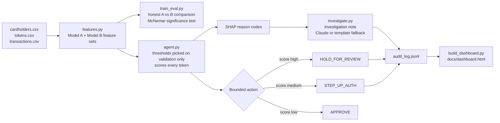

# TokenSentry — Provisioning Intelligence for Card-on-File Fraud

**Track:** AI Risk Manager · Razorpay AI Buildathon 2026

## The problem, in one line

When a card is tokenised for the first time (Card-on-File Tokenisation, CoFT), that **provisioning event** carries fraud signal that most systems throw away — they only start watching once a transaction happens. TokenSentry watches the provisioning event itself.

## Where this sits relative to existing industry solutions

Provisioning-time fraud scoring is not a new idea — it's worth being upfront about that. **Visa Provisioning Intelligence (VPI)**, launched commercially in December 2023, scores token requests for issuers (Visa reports $809M in annual token provisioning fraud losses globally as of 2025). Mastercard runs the equivalent under **Decision Intelligence** (issuer-side) and **Transaction Fraud Monitoring** (acquirer-side).

**The layer is different, and that difference is the point.** VPI and its Mastercard equivalents operate at the **network → issuer** boundary — they score a token request *before* the issuer approves it. TokenSentry operates at the **PSP / token-requestor layer** (Razorpay's own vantage point as the party actually running TokenHQ) — watching what happens *after* a token has already been provisioned, independent of whatever score the network gave upstream.

That gap is not hypothetical. Mastercard's own fraud-prevention literature warns about it directly: issuers and merchants may under-monitor a token specifically *because* they trust it was already screened at provisioning — so a fraudster who clears the network's provisioning check has "cleared a major security hurdle" before a single transaction happens. TokenSentry is built for exactly that gap: a downstream, PSP-side safety net that doesn't take an upstream approval as proof of legitimacy.

## Why this is a real Razorpay problem, not a hypothetical

- Razorpay operates **TokenHQ**, a multi-network CoFT platform, acting as the **Token Requestor** for merchants — i.e. Razorpay is the party actually provisioning tokens, at scale, today.
- Razorpay also runs **Push Provisioning**, where banks pre-tokenise a card across multiple merchants in one flow.
- RBI's tokenisation/authentication rules are live regulation with a **compliance deadline of April 1, 2026** — this is an active, dated obligation, not a stale problem.
- Razorpay's existing fraud subsidiary, **Thirdwatch**, does transaction-level ML risk scoring (device fingerprint, location, behaviour) — but for **order/RTO fraud, not provisioning-time signal**. TokenSentry is the natural extension: apply the same ML discipline one step earlier, at the moment the token is born.

## The core hypothesis, tested honestly

> Does adding provisioning-time signal (device history, geo-velocity, provisioning-to-transaction latency, auth factor) meaningfully improve fraud detection over transaction data alone?

We test this as two models on the **same held-out test set**:

| Model | Features | Precision | Recall | F1 |
|---|---|---|---|---|
| **A — transaction-only baseline** | amount, velocity, txn-to-home distance, category diversity | 0.694 | 0.397 | 0.505 |
| **B — provisioning-enhanced** | Model A + device-card degree, provisioning-to-home distance, provisioning-to-first-txn latency, auth factor | **0.935** | **0.683** | **0.789** |

**McNemar's test on paired predictions: p < 0.00001.** The improvement is statistically significant, not sampling noise.

**Where the lift comes from** (breakdown by fraud subtype on the held-out set):

| Fraud subtype | n | Model A recall | Model B recall | Lift |
|---|---|---|---|---|
| Mule-device (device reused across victims) | 122 | 0.450 | 0.825 | +0.375 |
| One-off (unique device, no reuse signal at all) | 76 | 0.304 | 0.435 | +0.130 |

The one-off row matters most: there is **no device-graph signal available at all** for that fraud type, yet Model B still beats Model A — proving the lift isn't just "catching repeat devices," geo-velocity and latency are pulling real weight too.

## Data honesty notes

- All data is **synthetic**, generated to include deliberately hard cases: benign family-shared devices (multiple legitimate cardholders on one device), legitimate travel (geo-velocity false-positive risk), and same-city fraud (defeats geo-velocity, must be caught by other signals).
- Train/test split is at the **cluster level** (cardholders linked via a shared device are entirely in train or entirely in test) — the model never memorises a specific device_id, it has to learn the underlying pattern.
- Fraud prevalence in this dataset (~2%) is elevated versus real-world CoFT fraud rates for statistical evaluation power — flagged explicitly rather than left implicit.

## Architecture



```
cardholders.csv, tokens.csv, transactions.csv
            │
            ▼
   features.py — builds Model A features (transaction-only)
                 and Model B features (+ provisioning intelligence)
            │
            ▼
   train_eval.py — trains both models on identical splits,
                    reports honest metrics + McNemar significance
                    + fraud-subtype breakdown
            │
            ▼
   agent.py — the actual agent:
     1. picks HOLD / STEP_UP thresholds on a VALIDATION split
        carved from train (never touches test)
     2. scores every token with the final model
     3. explains each flagged decision with SHAP reason codes
     4. takes one bounded action: APPROVE / STEP_UP_AUTH / HOLD_FOR_REVIEW
     5. writes every decision to data/audit_log.jsonl
```

## The agent's decisions are bounded and defensive

Three actions only — no autonomous blocking, everything human-reviewable:

- `APPROVE` — let it through
- `STEP_UP_AUTH` — require an extra verification factor before allowing
- `HOLD_FOR_REVIEW` — pause, route to a human fraud analyst, with the reason codes attached

Example audit entry (real output from this repo):

```json
{
  "token_id": "tok_0899d3c085",
  "risk_score": 0.9981,
  "action": "HOLD_FOR_REVIEW",
  "reason_codes": [
    "this device has provisioned tokens for 7 other cardholder(s)",
    "average transaction amount is Rs14,165",
    "3 transactions on this token so far"
  ],
  "model_version": "tokensentry-modelB-v1"
}
```

## Real-time architecture: two honest stages, not one after-the-fact score

An earlier version of this repo scored a token once, using its *entire*
transaction history at once — which quietly assumes information from the
future, since a freshly-provisioned token has no transactions yet. Real-time
only works if the agent is honest about what it actually knows at each moment:

- **Stage 1 — at provisioning**, before any money moves: `Model P` scores using
  only what's knowable then — device history, geo distance from home, auth
  factor. Precision 0.796, recall 0.619 on the held-out test set, using nothing
  but 4 features. This is what the agent can act on instantly.
- **Stage 2 — at first transaction**, once behaviour exists: `Model B` re-scores
  with the full picture, and can escalate past whatever Stage 1 decided.

```bash
cd src
python3 train_provisioning_model.py   # trains + saves data/model_p.joblib
python3 agent.py                      # (if not already run) saves data/model_b.joblib
python3 live_server.py                # starts the live agent on :5050
# in a second terminal:
python3 simulate_live_stream.py       # streams a scripted, repeatable narrative -- best for recording
# or, for a longer live demo (e.g. during a panel interview), runs until Ctrl+C:
python3 simulate_live_stream_continuous.py
```

Open `http://127.0.0.1:5050/dashboard` in a browser to watch decisions arrive
live while either script runs.
Watch the terminal running `live_server.py` — a benign device stays `APPROVE`
throughout; a device that's already provisioned several other cardholders'
cards escalates live: `APPROVE → WATCH → STEP_UP_AUTH → HOLD_FOR_REVIEW` as
evidence accumulates, each with real SHAP-derived reason codes, not canned
ones. `GET /queue` returns every decision made since the server started.

### Is this running on a stream-processing engine? No — and that's a deliberate scope choice, not a gap

`live_server.py` is a Flask API with an in-memory feature store, not Kafka,
Flink, or Spark Streaming. Every event is scored synchronously, in
milliseconds, the instant it's POSTed — which is genuinely real-time in the
sense that actually matters for a fraud decision (act before the transaction
completes, not on a batch schedule). What it does **not** have: a durable
message broker, replay on crash, or horizontal scaling across machines —
state lives in memory and resets if the process restarts.

That gap is intentional for this stage, not a blind spot. Building a real
Kafka/Kinesis pipeline in a hackathon timeframe would spend the remaining
time on infrastructure that isn't what's being evaluated, at real risk of
breaking something working right before the deadline. The part that's
actually hard — correct, leakage-free, temporally-honest scoring logic, so
the model never uses information from the future — is what's built and
tested here. In production, only the transport layer changes: `FeatureStore`
and the two models would sit unchanged behind a Kafka consumer instead of a
Flask route.

## Enterprise Architecture Mapping (Medallion Pattern)

To ensure evaluators and judges can test TokenSentry locally in seconds (`pip install` without requiring cloud credentials or cluster setups), the application executes locally while strictly following the **Databricks Medallion Architecture**:

| Medallion Layer | TokenSentry Local Implementation | Enterprise Production Mapping (Razorpay Scale) |
|---|---|---|
| **Bronze** (Raw Data) | `cardholders.csv`, `tokens.csv`, `transactions.csv` | High-throughput streaming ingestion (Kafka → Delta Lake) |
| **Silver** (Cleaned & Joined) | `features.py` — vectorized pandas features & joins | Distributed PySpark feature store (pandas DataFrame logic maps 1:1 to PySpark) |
| **Gold** (Decision-Ready) | `audit_log.jsonl`, `docs/dashboard.html` | Gold Delta tables powering real-time risk dashboards & automated transaction holds |

The feature engineering pipeline in `features.py` uses vectorized operations specifically designed so it can be deployed directly to PySpark / Databricks with zero architectural redesign.

## How to run

**Fastest path — one command does everything** (creates the venv, installs
dependencies, runs the full pipeline, runs the tests):

```bash
./setup.sh          # Mac/Linux
.\setup.ps1          # Windows PowerShell
```

**Or, step by step, if you want to see each stage:**


```bash
cd src
python3 generate_data.py   # builds data/{cardholders,tokens,transactions}.csv
python3 features.py        # builds data/features.csv, prints feature separation
python3 train_eval.py      # Model A vs B, McNemar test, subtype breakdown
python3 agent.py           # thresholds, scoring, SHAP reasons, audit_log.jsonl
```

No API key required — the pipeline runs fully offline on synthetic data.

## Real Razorpay test-mode enforcement (optional)

Everything above runs entirely offline on synthetic data — that has to stay
synthetic, since Razorpay's public API does not (and should not) expose
device/geo/provisioning telemetry to third-party consumers. But the agent's
*decisions* can be enforced against real Razorpay test-mode infrastructure,
not just simulated in Python.

`agent.py` decides one of three bounded actions per token. `razorpay_integration.py`
creates a real order in your Razorpay Test Mode account for each one, using
Razorpay's actual authorize/capture mechanism:

- `APPROVE` → order created with `payment_capture: 1` (auto-capture)
- `STEP_UP_AUTH` / `HOLD_FOR_REVIEW` → order created with `payment_capture: 0`
  (held in `authorized` state; Razorpay auto-refunds it if nobody captures it —
  a real mechanism, not a simulated one, proving the hold actually stops money)

```bash
# On macOS / Linux (bash/zsh):
export RAZORPAY_KEY_ID=rzp_test_xxxxx
export RAZORPAY_KEY_SECRET=xxxxx

# On Windows (PowerShell):
$env:RAZORPAY_KEY_ID="rzp_test_xxxxx"
$env:RAZORPAY_KEY_SECRET="xxxxx"

# Run the test-mode enforcement script
python src/razorpay_integration.py
```

Every order created is logged to `data/razorpay_orders_log.jsonl` with the
real `order_id` Razorpay returns, and is visible directly in your own
Test Mode dashboard under Transactions → Orders. This module is optional
and fails gracefully with clear setup instructions if no keys are set —
the core pipeline never depends on it.

## Roadmap / what's next in this repo

- [x] Interactive dashboard for the flagged-token queue (demo surface)
- [x] Optional LLM-generated investigation narrative on top of SHAP reason codes (falls back to the template above if no API key is set)
- [x] Real-time two-stage scoring (Model P at provisioning, Model B at first transaction)
- [x] Architecture diagram (Mermaid, above)
- [x] 5-minute pitch script
- [ ] Real Kafka/Kinesis ingestion layer in front of the live scoring service (see "Is this running on a stream-processing engine?" above for why this is intentionally out of scope for now)
